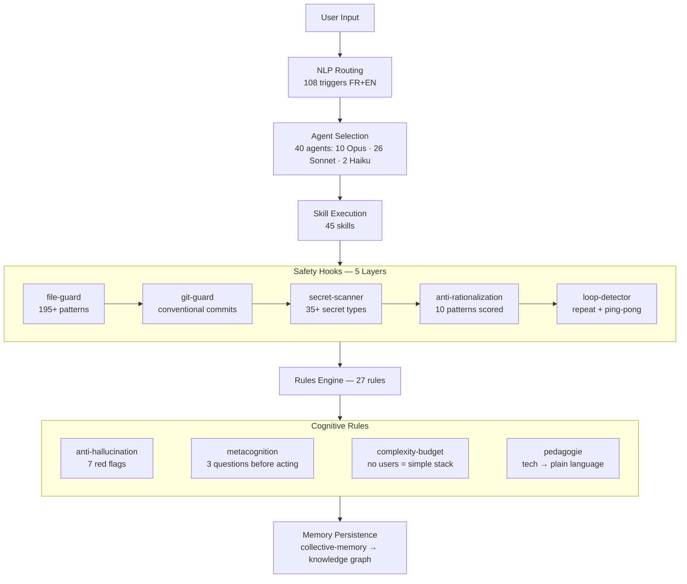

# ATUM SYSTEM

[](https://github.com/arnwaldn/atum-system/actions/workflows/ci.yml)
[](LICENSE)
[](https://github.com/arnwaldn/atum-system/releases/tag/v1.0.0)

**Cognitive architecture for Claude Code** — changes how Claude *thinks*, not just what it *does*.

Other configs add more skills and commands. ATUM reshapes Claude's reasoning with anti-hallucination rules, metacognition protocols, complexity budgets, and 5-layer runtime safety. 40 agents, 45 skills, 31 hooks, 27 rules — all integrated into a self-reinforcing system.

## Why ATUM?

|  | Typical configs | ATUM System |
|---|---|---|
| **Approach** | More skills and commands | Cognitive rules that reshape reasoning |
| **Safety** | Permission prompts | 5-layer runtime hooks (file-guard, git-guard, secret-scanner, anti-rationalization, loop-detector) |
| **Memory** | Per-session only | Persistent collective memory shared across team members |
| **Quality** | Trust the output | Anti-rationalization blocks "should work" — demands proof |
| **Routing** | Manual `/commands` | 108 NLP triggers (FR+EN) auto-detect intent |
| **Engineering** | "Use best practices" | Complexity budget: no users yet? SQLite, not Kubernetes |

## Quick Start

```bash
/plugin marketplace add arnwaldn/atum-system
/plugin install atum-system@arnwaldn-atum-system
/reload-plugins
```

Works on all Claude Code surfaces: Terminal, VS Code, JetBrains, Desktop, Browser.

> For the full install (permissions, scheduler, MCP secrets), see [Install Details](#install-details) below.

## Architecture



## What Makes It Different

Five innovations no other Claude Code config has:

**1. Anti-Rationalization** — A Stop hook scores 10 premature-completion patterns ("should work", "out of scope", "for a follow-up") with severity weights. Score exceeds threshold → Claude is forced to continue. Inspired by Trail of Bits, extended with bilingual patterns and ATUM-specific detections.

**2. Complexity Budget** — A rule that blocks over-engineering: "No users yet? SQLite. Under 100 users? Monolith. 'Best practice' is not a justification — measured need is." This prevents the classic AI failure of proposing Kubernetes for a prototype.

**3. Metacognition** — Before acting, Claude must answer 3 questions: "What do I understand?", "What tools do I have?", "What sequence is optimal?". Escalation: 3 failures → stop and propose alternatives. Prevents the "keep trying the same thing" loop.

**4. Pedagogie** — Every technical term is explained in plain language on first use. API = "a service counter: you ask, it answers". Cache = "a sticky note so you don't recalculate". Decisions with user impact are presented with concrete trade-offs, not pattern names.

**5. Collective Memory** — A shared knowledge base across team members with confidentiality rules (professional → shared, personal → local only). Sessions are persisted to a knowledge graph via a queue system that works around the hook/MCP limitation.

## What's Inside

| Category | Count | Highlights |
|----------|-------|------------|
| **Hooks** | 31 | file-guard, anti-rationalization, secret-scanner, git-guard, loop-detector, session-to-graph, precompact-save, image-auto-resize |
| **Commands** | 31 | `/scaffold`, `/security-audit`, `/tdd`, `/deploy`, `/schedule`, `/compliance`, `/atum-audit`, `/whatsapp` |
| **Agents** | 40 | 10 Opus (security, compliance, architecture) · 26 Sonnet (dev, DevOps, ML, game) · 2 Haiku (fast tasks) |
| **Skills** | 45 | PDF, DOCX, DDD, RAG, Mermaid, scheduler, compliance-routing, autonomous-routing (108 NLP triggers) |
| **Modes** | 4 | architect, autonomous, brainstorm, quality |
| **Rules** | 27 | anti-hallucination, metacognition, complexity-budget, pedagogie, security, testing, decision-gate |
| **MCP Servers** | 20+ | Memory, Context7, GitHub, Google Workspace, WhatsApp, ATUM Audit |

## Safety Model

Full autonomy (no permission prompts) secured by runtime hooks:

| Hook | What it does |
|------|-------------|
| **file-guard** | Blocks access to 195+ sensitive file patterns (SSH keys, .env, wallets, certificates) |
| **git-guard** | Blocks push to main, force-push; enforces conventional commits and branch naming |
| **secret-scanner** | Detects 35+ hardcoded secret patterns (AWS, Stripe, GitHub, OpenAI, Anthropic, etc.) before commit |
| **anti-rationalization** | Detects premature completion (10 patterns with severity weights); blocks vague "should work" claims |
| **loop-detector** | Detects consecutive repeats, ping-pong alternation (A↔B), and context exhaustion |
| **image-auto-resize** | Auto-resizes images >1800px before they enter context (prevents API dimension limit errors) |
| **precompact-save** | Saves critical context (modified files, errors, commits) before compaction |
| **session-to-graph** | Queues session entities for knowledge graph persistence |

## NLP Auto-Routing

108 triggers (French + English) auto-detect intent and invoke the right workflow:

| You say | ATUM does |
|---------|-----------|
| "Create a PDF" | → `/pdf` skill |
| "Audit RGPD" | → compliance-expert agent + ATUM Audit MCP |
| "EU AI Act compliance" | → `compliance_status` + `compliance_validate` |
| "Deploy on Render" | → `/deploy` skill |
| "Quick website" | → B12 MCP `generate_website` |
| "Schedule a daily task" | → `/schedule` skill (NL → cron → daemon) |

## For Non-ATUM Users

ATUM System was built for [ATUM SAS](https://github.com/arnwaldn) but is designed to be customized:

1. **Replace `CLAUDE.md`** — Change the identity from "Dev senior ATUM SAS" to your own team description
2. **Remove `data/agence-atum/`** — This contains ATUM-specific business templates (contracts, invoices). Delete if not needed
3. **Set `ATUM_USER`** — Change the env var to your username for collective memory
4. **Keep everything else** — The hooks, rules, agents, skills, and modes are project-agnostic

## Install Details

### Plugin (recommended)

```bash
/plugin marketplace add arnwaldn/atum-system
/plugin install atum-system@arnwaldn-atum-system
/reload-plugins
```

### Full Install (advanced)

```bash
git clone https://github.com/arnwaldn/atum-system.git
cd atum-system && bash install.sh
```

**Prerequisites**: Node.js, Python 3, Git, [Claude Code CLI](https://docs.anthropic.com/en/docs/claude-code)

### Plugin vs Full Install

| Feature | Plugin | Full Install |
|---------|--------|-------------|
| 40 agents, 45 skills, 31 commands, 31 hooks, 4 modes | Yes | Yes |
| 6 MCP servers (no secrets) | Yes | Yes |
| 27 rules | Via skills | Yes |
| 14 MCP servers (with secrets) | No | Yes |
| Permissions (full autonomy) | No | Yes |
| Scheduler daemon (PM2) | No | Yes |
| Collective memory sync | No | Yes |

### Post-Install (Full Install only)

1. Restart Claude Code
2. Set env vars:
   ```bash
   export GITHUB_PERSONAL_ACCESS_TOKEN="$(gh auth token 2>/dev/null)"
   export ATUM_USER="your-name"
   ```
3. Configure remote MCP in claude.ai settings: Figma, Notion, Supabase, Vercel, Canva, Stripe, Gamma

## Languages & Frameworks

Rules and agents cover: TypeScript, Python, Go, Rust, Java, .NET, PHP, Ruby, Dart, Solidity.

Frameworks: Next.js, Vue, Svelte, FastAPI, Django, Flask, Express, NestJS, Spring Boot, Laravel, Rails, Flutter, Tauri, Electron, Phaser, Three.js, Godot, Hardhat.

## License

[MIT](LICENSE)
