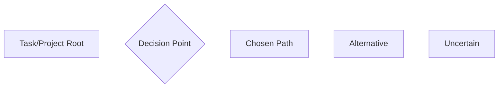
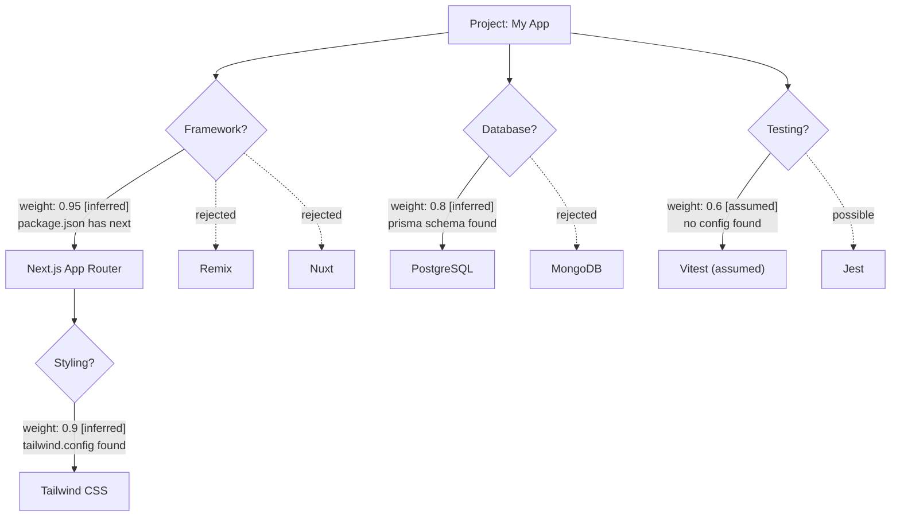

# Reasoning Graph

## Purpose

Visualize Claude's decision tree — not just what was assumed, but WHY. Shows decision points, chosen paths, and alternatives considered.

## Mermaid Conventions

### Node Types



### Styling

```
classDef root fill:#1a1a2e,stroke:#16213e,color:#fff
classDef decision fill:#0f3460,stroke:#16213e,color:#fff
classDef chosen fill:#006d77,stroke:#006d77,color:#fff
classDef alternative fill:#4a4a4a,stroke:#666,color:#aaa
classDef uncertain fill:#e76f51,stroke:#e76f51,color:#fff
```

### Edge Labels

```
-->|"weight: 0.9 [inferred]"| : High-confidence inferred choice
-->|"weight: 0.5 [assumed]"|  : Medium-confidence assumption
-.->|"rejected"|              : Alternative not chosen (dashed)
```

## Graph Generation

### Step 1: Identify Decision Points

For each ESTABLISHED or WORKING assumption, trace back:
- What alternatives existed?
- What evidence led to this choice?
- What would have changed with a different decision?

### Step 2: Build Tree



### Step 3: Annotate Confidence

Each path shows:
- **Weight**: 0.0-1.0 confidence
- **Type**: [stated], [inferred], [assumed], [uncertain]
- **Evidence**: Brief source reference

## Interactive Refinement

When user interacts with the graph:

| User Says | Action |
|-----------|--------|
| "Expand {branch}" | Add child nodes with deeper detail |
| "Why not {alternative}?" | Explain reasoning, show evidence |
| "Actually, it's {alternative}" | Update graph: swap chosen/alternative, update assumption |
| "What depends on {node}?" | Highlight downstream nodes |

After each interaction, regenerate the graph with updated state.

## Embedding in COMMON-GROUND.md

Add as a section:

```markdown
## Reasoning Graph

<!-- Generated: {timestamp} -->
<!-- Nodes: {count} | Decisions: {count} | Open: {count} -->


### Decision Log
| Decision | Chosen | Confidence | Alternatives | Evidence |
|----------|--------|-----------|-------------|---------|
| Framework | Next.js | 0.95 | Remix, Nuxt | package.json |
```
