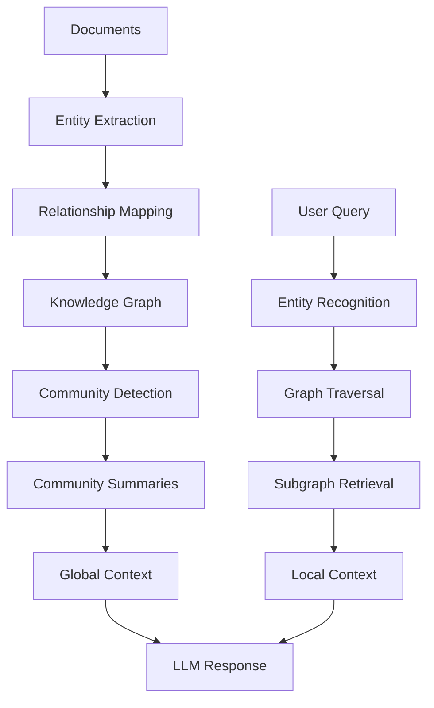
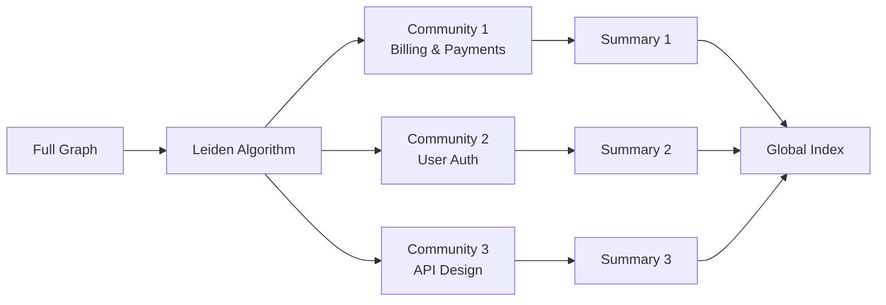
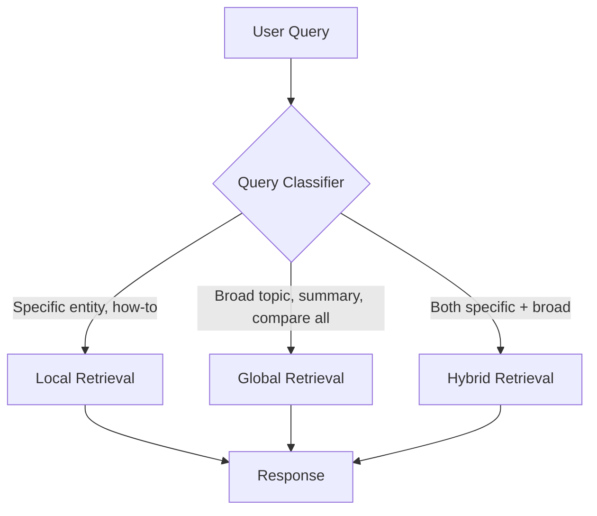

# GraphRAG Patterns

Graph-based Retrieval-Augmented Generation — reduces hallucinations by grounding responses in a structured knowledge graph instead of raw vector similarity alone.

Sources: Microsoft Research GraphRAG, FalkorDB 2025, community implementations.

---

## Why GraphRAG

Standard RAG retrieves isolated chunks. GraphRAG retrieves connected knowledge:

| Aspect | Vector RAG | GraphRAG |
|--------|-----------|----------|
| Retrieval unit | Text chunk | Entity + relationships |
| Handles "how do X and Y relate?" | Weak | Strong |
| Multi-hop reasoning | No | Yes |
| Global summarization | No (per-chunk) | Yes (community detection) |
| Hallucination rate | 15-20% | <2% (Microsoft benchmark) |
| Build cost | Low | Medium-High |
| Query latency | Low | Medium |

---

## Architecture Overview



---

## Knowledge Graph Construction

### Entity Extraction

```python
EXTRACT_PROMPT = """Extract entities and relationships from the text.

For each entity:
- name: exact string as appears in text
- type: PERSON | ORGANIZATION | TECHNOLOGY | CONCEPT | LOCATION | EVENT
- description: one-sentence description

For each relationship:
- source: entity name
- target: entity name
- type: USES | REQUIRES | CREATES | BELONGS_TO | CAUSES | COMPETES_WITH | PART_OF
- description: brief description of the relationship

Return JSON:
{
  "entities": [{"name": str, "type": str, "description": str}],
  "relationships": [{"source": str, "target": str, "type": str, "description": str}]
}

Text:
{text}"""

async def extract_entities(text: str, client) -> dict:
    response = await client.messages.create(
        model="claude-sonnet-4-6",
        max_tokens=2048,
        messages=[{"role": "user", "content": EXTRACT_PROMPT.format(text=text)}]
    )
    import json
    return json.loads(response.content[0].text)
```

### Graph Node Schema

```typescript
interface GraphNode {
  id: string                    // kebab-case unique ID
  name: string                  // canonical name
  type: EntityType
  description: string
  aliases: string[]             // alternate names / spellings
  confidence: number            // 0-1, based on extraction count
  source_chunks: string[]       // chunk IDs where entity appeared
  created_at: Date
  last_updated: Date
}

interface GraphEdge {
  id: string
  from_id: string
  to_id: string
  type: RelationType
  description: string
  weight: number                // 0-1, strength of relationship
  evidence: string[]            // chunk IDs as evidence
  bidirectional: boolean
}
```

---

## Graph Traversal for Retrieval

### Local retrieval — entity neighborhood

```python
async def retrieve_local(query: str, graph_db, top_k: int = 5) -> dict:
    """Retrieve the neighborhood of query-relevant entities."""

    # 1. Find entities matching the query
    query_entities = await extract_query_entities(query)

    # 2. For each entity, get its 2-hop neighborhood
    subgraph = {"nodes": [], "edges": []}
    for entity_name in query_entities:
        node = await graph_db.find_node(name=entity_name)
        if not node:
            continue

        # Get direct neighbors (depth=1)
        neighbors = await graph_db.get_neighbors(node.id, depth=2)
        subgraph["nodes"].extend(neighbors["nodes"])
        subgraph["edges"].extend(neighbors["edges"])

    # 3. Deduplicate and rank by relevance
    subgraph = deduplicate_subgraph(subgraph)
    ranked = rank_by_relevance(subgraph, query)
    return ranked[:top_k]
```

### Global retrieval — community summaries

```python
async def retrieve_global(query: str, community_store) -> str:
    """Retrieve community-level summaries for broad/abstract queries."""

    # Communities are pre-computed via Leiden/Louvain algorithm
    communities = await community_store.search(query, top_k=3)

    context = []
    for community in communities:
        context.append(f"## {community.title}\n{community.summary}")

    return "\n\n".join(context)
```

---

## Community Detection for Summarization



```python
def detect_communities(graph) -> list[Community]:
    """Use Leiden algorithm for community detection."""
    import igraph as ig
    import leidenalg

    # Convert to igraph format
    g = ig.Graph()
    g.add_vertices([n.id for n in graph.nodes])
    g.add_edges([(e.from_id, e.to_id) for e in graph.edges])
    g.es["weight"] = [e.weight for e in graph.edges]

    # Detect communities
    partition = leidenalg.find_partition(
        g,
        leidenalg.ModularityVertexPartition,
        weights="weight"
    )

    communities = []
    for i, community_nodes in enumerate(partition):
        communities.append(Community(
            id=f"community_{i}",
            node_ids=[g.vs[n]["name"] for n in community_nodes],
            level=0  # hierarchical: level 0 = fine-grained
        ))

    return communities
```

---

## Hybrid Graph + Vector Retrieval

Best of both worlds: vector search for semantic similarity, graph traversal for connected reasoning.

```python
async def hybrid_retrieve(query: str, vector_store, graph_db, alpha: float = 0.5) -> list:
    """
    alpha=0.0 → pure vector
    alpha=1.0 → pure graph
    alpha=0.5 → balanced hybrid (recommended default)
    """
    import asyncio

    # Run in parallel
    vector_results, graph_results = await asyncio.gather(
        vector_store.search(query, top_k=10),
        retrieve_local(query, graph_db, top_k=10)
    )

    # Reciprocal Rank Fusion
    return reciprocal_rank_fusion(
        [vector_results, graph_results],
        weights=[1 - alpha, alpha]
    )

def reciprocal_rank_fusion(result_lists: list, weights: list, k: int = 60) -> list:
    scores = {}
    for results, weight in zip(result_lists, weights):
        for rank, item in enumerate(results):
            item_id = item["id"]
            scores[item_id] = scores.get(item_id, 0) + weight * (1 / (k + rank + 1))

    return sorted(scores.items(), key=lambda x: x[1], reverse=True)
```

---

## Query Routing



```python
ROUTE_PROMPT = """Classify this query for retrieval routing.
Options:
- LOCAL: asks about specific entities, relationships, or how-to (e.g., "How does X relate to Y?")
- GLOBAL: asks for broad summaries, overviews, or comparisons (e.g., "What are the main themes?")
- HYBRID: needs both specific detail and broad context

Query: {query}
Answer with one word: LOCAL, GLOBAL, or HYBRID"""
```

---

## Graph Storage Options

| Backend | Best For | Traversal | Scale |
|---------|---------|-----------|-------|
| NetworkX (in-memory) | Prototyping, <100k nodes | Python native | Small |
| Neo4j | Production, rich queries | Cypher | Large |
| FalkorDB | Redis-native, low latency | Cypher subset | Medium-Large |
| Amazon Neptune | AWS-native, managed | Gremlin/SPARQL | Enterprise |
| MCP Memory (`mcp__memory__*`) | Claude Code integration | Tool calls | Medium |

### MCP Memory as graph store

```typescript
// Create entity nodes
await mcp__memory__create_entities({
  entities: [{
    name: "Stripe",
    entityType: "Technology",
    observations: ["Payment processing API", "Requires webhook verification"]
  }]
})

// Create relationships
await mcp__memory__create_relations({
  relations: [{
    from: "Stripe",
    to: "Webhook-Verification",
    relationType: "REQUIRES"
  }]
})

// Retrieve subgraph
const context = await mcp__memory__search_nodes({ query: "Stripe payment" })
```

---

## Graph Quality Metrics

| Metric | Target | Action if Below |
|--------|--------|-----------------|
| Entity confidence avg | > 0.8 | Re-extract from more sources |
| Orphan nodes (no edges) | < 5% | Link or remove |
| Community coherence | > 0.6 | Tune Leiden resolution |
| Query hit rate (graph finds entities) | > 85% | Expand entity aliases |
| Node staleness (>30 days unverified) | < 10% | Re-verify old nodes |

---

## When to Use GraphRAG vs Standard RAG

| Scenario | Use |
|----------|-----|
| "How are X and Y related?" | GraphRAG |
| "What are all the connections to Z?" | GraphRAG |
| "Summarize this entire knowledge base" | GraphRAG (global) |
| "Find documents about topic T" | Vector RAG |
| "Answer this question from these docs" | Vector RAG |
| "Multi-hop: find X's dependency's owner" | GraphRAG |
| Real-time ingestion required | Vector RAG (lower build cost) |
| Complex relational domain (legal, medical) | GraphRAG |
